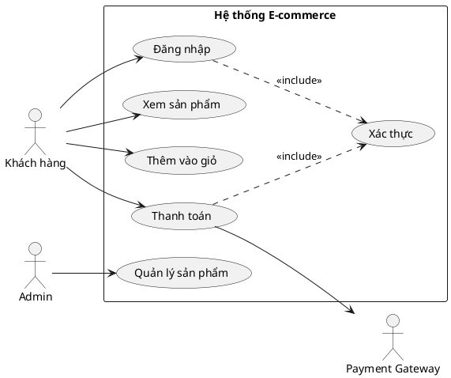

# Hướng Dẫn Chi Tiết Về Use Case Diagram

## 1. Use Case Diagram Là Gì?

Use Case Diagram (Sơ đồ ca sử dụng) là một loại sơ đồ UML mô tả chức năng của hệ thống từ góc nhìn của người dùng. Nó thể hiện mối quan hệ giữa các Actor (tác nhân) và các Use Case (ca sử dụng).

---

## 2. Các Thành Phần Chính

### 2.1 Actor (Tác nhân)
- Đại diện cho người dùng hoặc hệ thống bên ngoài tương tác với hệ thống
- Ký hiệu: Hình người que (stick figure)
- Ví dụ: Khách hàng, Admin, Hệ thống thanh toán

⚠️ **QUAN TRỌNG: Actor LUÔN nằm NGOÀI System Boundary**
- Actor không phải là một phần của hệ thống đang xây dựng
- Actor là thực thể bên ngoài khởi tạo hoặc tham gia vào use case
- Nếu một thành phần nằm trong hệ thống → đó KHÔNG phải actor

### 2.2 Use Case (Ca sử dụng)
- Mô tả một chức năng cụ thể của hệ thống
- Ký hiệu: Hình elip (oval)
- Đặt tên bằng động từ + danh từ (VD: "Đăng nhập", "Tạo đơn hàng")

### 2.3 System Boundary (Ranh giới hệ thống)
- Hình chữ nhật bao quanh các use case
- Xác định phạm vi của hệ thống

### 2.4 Relationships (Quan hệ)

| Loại quan hệ | Ký hiệu | Mô tả |
|--------------|---------|-------|
| Association | Đường thẳng | Kết nối Actor với Use Case |
| Include | Mũi tên nét đứt + `<<include>>` | Use case A luôn gọi use case B |
| Extend | Mũi tên nét đứt + `<<extend>>` | Use case B mở rộng use case A (tùy chọn) |
| Generalization | Mũi tên tam giác rỗng | Kế thừa giữa Actor hoặc Use Case |

---

## 2.5 Phân Biệt Include và Extend (Chi Tiết)

### 🔵 INCLUDE - Quan hệ bắt buộc

**Định nghĩa:** Use case A **BẮT BUỘC** phải thực hiện use case B để hoàn thành.

**Đặc điểm:**
- Use case con (included) là một phần **không thể thiếu** của use case cha
- Mũi tên đi **TỪ use case cha → ĐẾN use case con**
- Use case con thường được **tái sử dụng** bởi nhiều use case khác

**Khi nào dùng Include:**
- Khi một hành động **luôn luôn** xảy ra trong use case
- Khi muốn **tách logic chung** ra để tái sử dụng
- Khi use case con là **điều kiện tiên quyết** để hoàn thành use case cha

**Ví dụ Include:**
```
┌─────────────────────────────────────────┐
│                                         │
│   ┌──────────────┐                      │
│   │  Rút tiền    │                      │
│   └──────┬───────┘                      │
│          │                              │
│    <<include>>                          │
│          │                              │
│          ▼                              │
│   ┌──────────────┐                      │
│   │  Xác thực    │  ← Bắt buộc phải     │
│   │  thẻ ATM     │    xác thực trước    │
│   └──────────────┘    khi rút tiền      │
│                                         │
└─────────────────────────────────────────┘

- "Rút tiền" INCLUDE "Xác thực thẻ ATM"
- Không thể rút tiền mà không xác thực → BẮT BUỘC
```

**Các trường hợp phổ biến dùng Include:**
| Use Case Cha | Include | Lý do |
|--------------|---------|-------|
| Đặt hàng | Xác thực người dùng | Phải đăng nhập mới đặt được |
| Chuyển tiền | Kiểm tra số dư | Luôn phải kiểm tra trước khi chuyển |
| Gửi email | Xác thực SMTP | Bắt buộc để gửi được email |
| Xem báo cáo | Truy vấn database | Không có data thì không có báo cáo |

---

### 🟢 EXTEND - Quan hệ tùy chọn

**Định nghĩa:** Use case B **MỞ RỘNG** use case A trong một số điều kiện nhất định (không bắt buộc).

**Đặc điểm:**
- Use case mở rộng **CHỈ xảy ra khi có điều kiện** cụ thể
- Mũi tên đi **TỪ use case mở rộng → ĐẾN use case gốc**
- Use case gốc **vẫn hoàn chỉnh** mà không cần use case mở rộng

**Khi nào dùng Extend:**
- Khi một hành động **có thể xảy ra hoặc không**
- Khi muốn thêm **tính năng bổ sung** mà không làm phức tạp use case chính
- Khi hành động phụ thuộc vào **điều kiện/lựa chọn** của người dùng

**Ví dụ Extend:**
```
┌─────────────────────────────────────────┐
│                                         │
│   ┌──────────────┐                      │
│   │  Thanh toán  │  ← Use case gốc      │
│   └──────────────┘    (hoàn chỉnh)      │
│          ▲                              │
│          │                              │
│    <<extend>>                           │
│          │                              │
│   ┌──────────────┐                      │
│   │ Áp dụng mã   │  ← Tùy chọn, chỉ     │
│   │  giảm giá    │    khi KH có mã      │
│   └──────────────┘                      │
│                                         │
│   Điều kiện: Khách hàng có mã giảm giá  │
│                                         │
└─────────────────────────────────────────┘

- "Áp dụng mã giảm giá" EXTEND "Thanh toán"
- Có thể thanh toán mà không cần mã giảm giá → TÙY CHỌN
```

**Các trường hợp phổ biến dùng Extend:**
| Use Case Gốc | Extend | Điều kiện |
|--------------|--------|-----------|
| Thanh toán | Áp dụng voucher | Khi có mã giảm giá |
| Đăng ký | Đăng ký VIP | Khi chọn gói VIP |
| Tìm kiếm | Lọc nâng cao | Khi cần filter thêm |
| Đặt phòng | Yêu cầu đặc biệt | Khi có yêu cầu riêng |

---

### 📊 So Sánh Include vs Extend

| Tiêu chí | Include | Extend |
|----------|---------|--------|
| **Tính bắt buộc** | ✅ Bắt buộc | ❌ Tùy chọn |
| **Hướng mũi tên** | Cha → Con | Mở rộng → Gốc |
| **Use case gốc** | Không hoàn chỉnh nếu thiếu | Hoàn chỉnh độc lập |
| **Điều kiện** | Luôn thực hiện | Chỉ khi có điều kiện |
| **Mục đích** | Tái sử dụng logic chung | Thêm tính năng phụ |

### 🎯 Quy Tắc Nhớ Nhanh

```
INCLUDE = "PHẢI CÓ" (Must have)
- Hỏi: "Use case cha có thể hoàn thành mà KHÔNG CÓ use case con không?"
- Nếu KHÔNG → Dùng Include

EXTEND = "CÓ THỂ CÓ" (Nice to have)  
- Hỏi: "Use case gốc có thể hoàn thành mà KHÔNG CẦN use case mở rộng không?"
- Nếu CÓ → Dùng Extend
```

### ⚠️ Lỗi Thường Gặp

1. **Nhầm hướng mũi tên:**
   - Include: Base → Included (đúng)
   - Extend: Extension → Base (đúng)

2. **Dùng Extend cho logic bắt buộc:**
   - ❌ Sai: "Đăng nhập" extend "Xác thực" (xác thực là bắt buộc!)
   - ✅ Đúng: "Đăng nhập" include "Xác thực"

3. **Dùng Include cho tính năng tùy chọn:**
   - ❌ Sai: "Mua hàng" include "Áp dụng coupon" (coupon là tùy chọn!)
   - ✅ Đúng: "Áp dụng coupon" extend "Mua hàng"

---

## 3. Cấu Trúc Mô Tả Chi Tiết Một Use Case

```
Use Case ID: UC-001
Tên Use Case: [Tên ca sử dụng]
Actor chính: [Tác nhân chính]
Actor phụ: [Tác nhân phụ - nếu có]
Mô tả ngắn: [Tóm tắt mục đích]
Tiền điều kiện: [Điều kiện cần có trước khi thực hiện]
Hậu điều kiện: [Trạng thái sau khi hoàn thành]
Luồng chính (Main Flow):
  1. [Bước 1]
  2. [Bước 2]
  3. ...
Luồng thay thế (Alternative Flow):
  - [Mô tả các trường hợp khác]
Luồng ngoại lệ (Exception Flow):
  - [Mô tả các lỗi có thể xảy ra]
Ghi chú: [Thông tin bổ sung]
```

---

## 4. Ví Dụ Cụ Thể

### 4.1 Sơ đồ Use Case - Hệ thống đặt hàng

```
┌─────────────────────────────────────────────────────────┐
│                    HỆ THỐNG ĐẶT HÀNG                    │
│                                                         │
│    ┌──────────────┐                                     │
│    │  Đăng nhập   │◄─────────────┐                      │
│    └──────────────┘              │                      │
│           │                      │                      │
│     <<include>>            ┌─────┴─────┐                │
│           │                │           │                │
│           ▼                │  Khách    │                │
│    ┌──────────────┐        │   hàng    │                │
│    │ Xem sản phẩm │◄───────┤           │                │
│    └──────────────┘        │           │                │
│                            └─────┬─────┘                │
│    ┌──────────────┐              │                      │
│    │ Thêm vào giỏ │◄─────────────┤                      │
│    └──────────────┘              │                      │
│           │                      │                      │
│     <<include>>                  │                      │
│           │                      │                      │
│           ▼                      │                      │
│    ┌──────────────┐              │                      │
│    │  Thanh toán  │◄─────────────┘                      │
│    └──────────────┘                                     │
│           │                                             │
│     <<extend>>                                          │
│           │                                             │
│           ▼                                             │
│    ┌──────────────┐        ┌───────────┐                │
│    │ Áp dụng mã   │        │  Hệ thống │                │
│    │   giảm giá   │        │ thanh toán│────────────────┤
│    └──────────────┘        └───────────┘                │
│                                                         │
└─────────────────────────────────────────────────────────┘
```

### 4.2 Mô tả chi tiết Use Case "Thanh toán"

```
Use Case ID: UC-003
Tên Use Case: Thanh toán đơn hàng
Actor chính: Khách hàng
Actor phụ: Hệ thống thanh toán (Payment Gateway)

Mô tả ngắn: 
Cho phép khách hàng thanh toán các sản phẩm trong giỏ hàng

Tiền điều kiện:
- Khách hàng đã đăng nhập
- Giỏ hàng có ít nhất 1 sản phẩm
- Sản phẩm còn hàng trong kho

Hậu điều kiện:
- Đơn hàng được tạo thành công
- Số lượng tồn kho được cập nhật
- Email xác nhận được gửi cho khách hàng

Luồng chính (Main Flow):
1. Khách hàng chọn "Thanh toán"
2. Hệ thống hiển thị trang thanh toán với thông tin đơn hàng
3. Khách hàng nhập/xác nhận địa chỉ giao hàng
4. Khách hàng chọn phương thức thanh toán
5. Khách hàng xác nhận thanh toán
6. Hệ thống gửi yêu cầu đến Payment Gateway
7. Payment Gateway xử lý và trả về kết quả thành công
8. Hệ thống tạo đơn hàng và gửi email xác nhận
9. Hệ thống hiển thị trang xác nhận đơn hàng

Luồng thay thế (Alternative Flow):
- 4a. Khách hàng áp dụng mã giảm giá:
  - 4a.1 Khách hàng nhập mã giảm giá
  - 4a.2 Hệ thống kiểm tra và áp dụng mã
  - 4a.3 Quay lại bước 4

Luồng ngoại lệ (Exception Flow):
- 7a. Thanh toán thất bại:
  - 7a.1 Hệ thống hiển thị thông báo lỗi
  - 7a.2 Khách hàng chọn phương thức thanh toán khác
  - 7a.3 Quay lại bước 5
- 2a. Sản phẩm hết hàng:
  - 2a.1 Hệ thống thông báo sản phẩm không còn
  - 2a.2 Khách hàng cập nhật giỏ hàng

Ghi chú:
- Timeout thanh toán: 15 phút
- Hỗ trợ: Visa, MasterCard, Momo, ZaloPay
```

---

## 5. Các Bước Tạo Use Case Diagram

### Bước 1: Xác định Actor
- Liệt kê tất cả người dùng/hệ thống tương tác với hệ thống
- Phân loại: Primary Actor (chính) và Secondary Actor (phụ)

### Bước 2: Xác định Use Case
- Liệt kê tất cả chức năng hệ thống cung cấp
- Mỗi use case phải mang lại giá trị cho actor

### Bước 3: Xác định quan hệ
- Vẽ association giữa actor và use case
- Xác định các quan hệ include/extend

### Bước 4: Vẽ sơ đồ
- Đặt actor bên ngoài system boundary
- Đặt use case bên trong system boundary
- Vẽ các đường quan hệ

### Bước 5: Mô tả chi tiết
- Viết specification cho từng use case
- Review và validate với stakeholder

---

## 6. Lưu Ý Quan Trọng

### ✅ Nên làm:
- Đặt tên use case bằng động từ + danh từ
- Giữ sơ đồ đơn giản, dễ đọc
- Tập trung vào chức năng, không phải cách thực hiện
- Mỗi use case phải có giá trị với actor
- Sử dụng include cho các chức năng bắt buộc
- Sử dụng extend cho các chức năng tùy chọn
- **Actor LUÔN đặt bên ngoài System Boundary**

### ❌ Không nên:
- Quá nhiều use case trong một sơ đồ (tối đa 15-20)
- Mô tả chi tiết kỹ thuật trong use case
- Nhầm lẫn giữa include và extend
- Tạo use case cho các bước nhỏ (như "Nhấn nút Submit")
- Bỏ qua các actor phụ (hệ thống bên ngoài)
- **KHÔNG đặt Actor bên trong System Boundary** - Actor là thực thể bên ngoài hệ thống
- **KHÔNG nhầm hướng mũi tên** của Include và Extend

---

## 7. Công Cụ Vẽ Use Case Diagram

| Công cụ | Loại | Ghi chú |
|---------|------|---------|
| Draw.io | Miễn phí | Online, dễ sử dụng |
| Lucidchart | Freemium | Nhiều template |
| PlantUML | Miễn phí | Code-based |
| StarUML | Trả phí | Chuyên nghiệp |
| Visual Paradigm | Trả phí | Đầy đủ tính năng |
| Mermaid | Miễn phí | Markdown-based |

---

## 8. Template PlantUML



---

## 9. Checklist Review Use Case

- [ ] Tất cả actor đã được xác định?
- [ ] Mỗi use case có ít nhất một actor?
- [ ] Tên use case rõ ràng, dùng động từ?
- [ ] Quan hệ include/extend đúng?
- [ ] Có mô tả chi tiết cho mỗi use case?
- [ ] Tiền điều kiện và hậu điều kiện đầy đủ?
- [ ] Luồng chính và luồng thay thế rõ ràng?
- [ ] Đã review với stakeholder?

---

*Tài liệu này được tạo để hướng dẫn xây dựng Use Case Diagram một cách chi tiết và chuyên nghiệp.*
