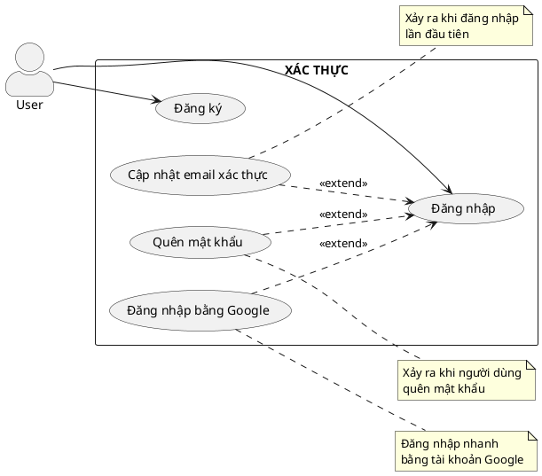
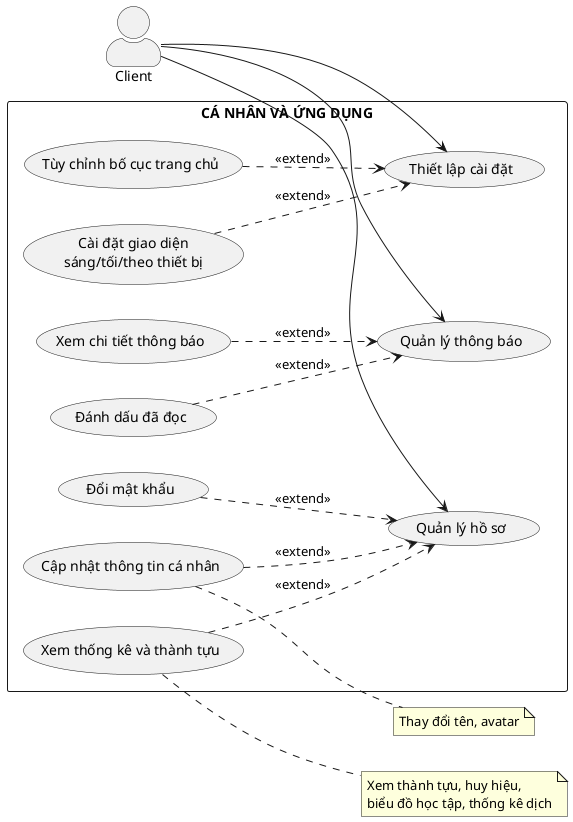
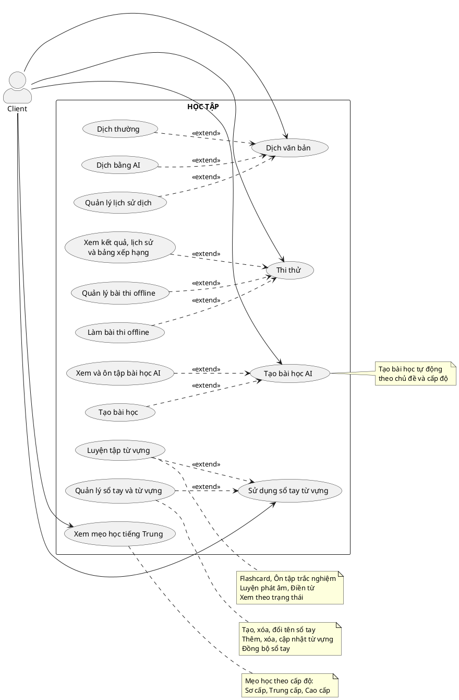
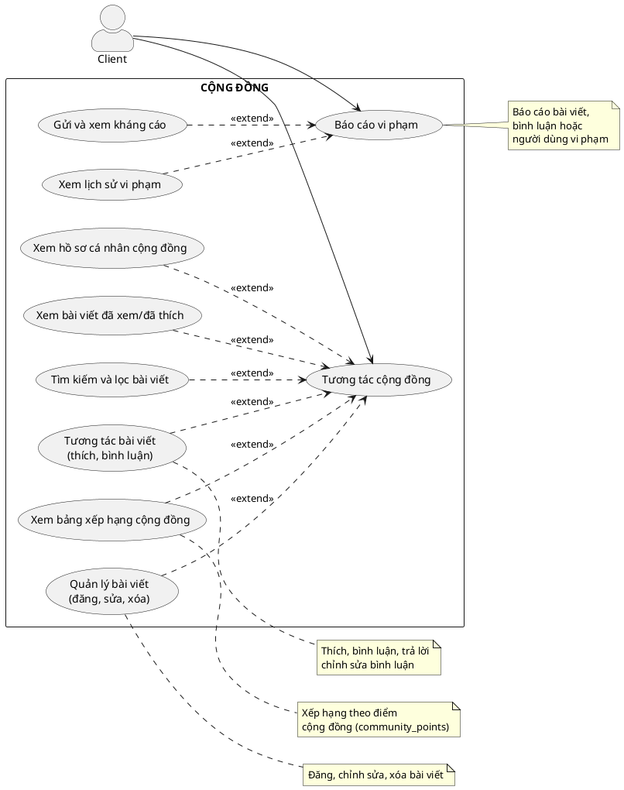
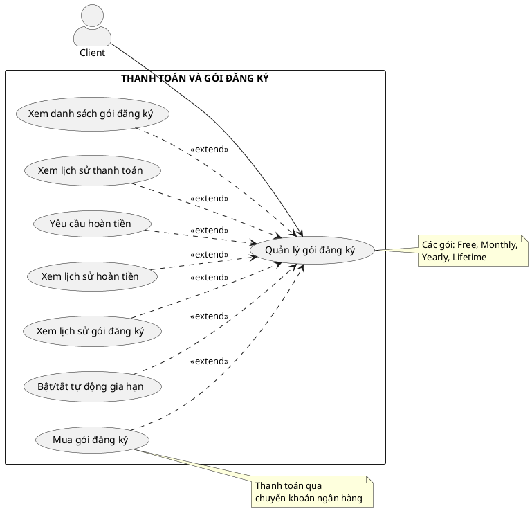

# Phân Tích Use Case - Hệ Thống Học Tiếng Trung

## Tổng Quan Hệ Thống

Ứng dụng học tiếng Trung (Chinese Learning App) hỗ trợ người dùng học từ vựng, luyện thi HSK, tương tác cộng đồng và sử dụng AI để tạo bài học.

---

## Danh Sách Tác Nhân (Actors)

| Tác nhân | Mô tả |
|----------|-------|
| User | Người dùng chưa đăng nhập hoặc đang thực hiện xác thực |
| Client | Người dùng đã đăng nhập, sử dụng các chức năng của hệ thống |

---

## Phân Nhóm Chức Năng & Use Case

### 1. NHÓM XÁC THỰC (Actor: User)

| Use Case Chính | Mở Rộng (Extend) |
|----------------|------------------|
| Đăng nhập | Cập nhật email xác thực |
| | Quên mật khẩu |
| | Đăng nhập bằng Google |
| Đăng ký | |

---

### 2. NHÓM CÁ NHÂN VÀ ỨNG DỤNG (Actor: Client)

| Use Case Chính | Mở Rộng (Extend) |
|----------------|------------------|
| Quản lý hồ sơ | Cập nhật thông tin cá nhân |
| | Đổi mật khẩu |
| | Xem thống kê và thành tựu |
| Thiết lập cài đặt | Tùy chỉnh bố cục trang chủ |
| | Cài đặt giao diện sáng/tối/theo thiết bị |
| Quản lý thông báo | Xem danh sách thông báo |
| | Xem chi tiết thông báo |
| | Đánh dấu đã đọc |

---

### 3. NHÓM HỌC TẬP (Actor: Client)

| Use Case Chính | Mở Rộng (Extend) |
|----------------|------------------|
| Dịch văn bản | Dịch thường |
| | Dịch bằng AI |
| | Quản lý lịch sử dịch |
| Thi thử | Xem kết quả, lịch sử và bảng xếp hạng |
| | Quản lý bài thi offline |
| | Làm bài thi offline |
| Sử dụng sổ tay từ vựng | Quản lý sổ tay và từ vựng |
| | Luyện tập từ vựng |
| Tạo bài học AI | Tạo bài học AI |
| | Xem và ôn tập bài học AI |
| Xem mẹo học tiếng Trung | Lọc theo cấp độ |
| | Xem theo chủ đề |

---

### 4. NHÓM CỘNG ĐỒNG (Actor: Client)

| Use Case Chính | Mở Rộng (Extend) |
|----------------|------------------|
| Tương tác cộng đồng | Quản lý bài viết (đăng, sửa, xóa) |
| | Tương tác bài viết (thích, bình luận) |
| | Xem bài viết đã xem/đã thích |
| | Tìm kiếm và lọc bài viết |
| | Xem bảng xếp hạng cộng đồng |
| | Xem hồ sơ cá nhân cộng đồng |
| Báo cáo vi phạm | Xem lịch sử vi phạm |
| | Gửi và xem kháng cáo |

---

### 5. NHÓM THANH TOÁN VÀ GÓI ĐĂNG KÝ (Actor: Client)

| Use Case Chính | Mở Rộng (Extend) |
|----------------|------------------|
| Quản lý gói đăng ký | Xem danh sách gói đăng ký |
| | Mua gói đăng ký |
| | Xem lịch sử thanh toán |
| | Yêu cầu hoàn tiền |
| | Xem lịch sử hoàn tiền |
| | Xem lịch sử gói đăng ký |
| | Bật/tắt tự động gia hạn |

---

## Sơ Đồ Use Case Tổng Quan

```plantuml
@startuml
left to right direction
skinparam packageStyle rectangle
skinparam actorStyle awesome

actor "User" as User
actor "Client" as Client

rectangle "HỆ THỐNG HỌC TIẾNG TRUNG" {
  
  package "Xác thực" {
    usecase "Đăng nhập" as UC_Login
    usecase "Đăng ký" as UC_Register
    usecase "Cập nhật email xác thực" as UC_UpdateEmail
    usecase "Quên mật khẩu" as UC_ForgotPwd
    usecase "Đăng nhập bằng Google" as UC_GoogleLogin
  }
  
  package "Cá nhân và ứng dụng" {
    usecase "Quản lý hồ sơ" as UC_Profile
    usecase "Cập nhật thông tin cá nhân" as UC_UpdateProfile
    usecase "Đổi mật khẩu" as UC_ChangePassword
    usecase "Xem thống kê và thành tựu" as UC_Stats
    usecase "Thiết lập cài đặt" as UC_Settings
    usecase "Tùy chỉnh bố cục trang chủ" as UC_Layout
    usecase "Cài đặt giao diện" as UC_Theme
    usecase "Quản lý thông báo" as UC_Notification
  }
  
  package "Học tập" {
    usecase "Dịch văn bản" as UC_Translate
    usecase "Dịch thường" as UC_NormalTranslate
    usecase "Dịch bằng AI" as UC_AITranslate
    usecase "Quản lý lịch sử dịch" as UC_TransHistory
    usecase "Thi thử" as UC_MockTest
    usecase "Xem kết quả, lịch sử và bảng xếp hạng" as UC_TestResult
    usecase "Quản lý bài thi offline" as UC_DownloadTest
    usecase "Sử dụng sổ tay từ vựng" as UC_Notebook
    usecase "Quản lý sổ tay và từ vựng" as UC_ManageNotebook
    usecase "Luyện tập từ vựng" as UC_PracticeVocab
    usecase "Tạo bài học AI" as UC_AILesson
    usecase "Tạo bài học" as UC_CreateAILesson
    usecase "Xem và ôn tập bài học AI" as UC_AIRevision
    usecase "Xem mẹo học" as UC_Tips
  }
  
  package "Cộng đồng" {
    usecase "Tương tác cộng đồng" as UC_Community
    usecase "Quản lý bài viết" as UC_ManagePost
    usecase "Tương tác bài viết" as UC_Interact
    usecase "Tìm kiếm và lọc bài viết" as UC_SearchPost
    usecase "Xem bảng xếp hạng cộng đồng" as UC_CommunityRank
    usecase "Báo cáo vi phạm" as UC_Report
    usecase "Gửi và xem kháng cáo" as UC_Appeal
  }
  
  package "Thanh toán và gói đăng ký" {
    usecase "Quản lý gói đăng ký" as UC_Subscription
    usecase "Mua gói đăng ký" as UC_BuySubscription
    usecase "Xem lịch sử thanh toán" as UC_PaymentHistory
    usecase "Yêu cầu hoàn tiền" as UC_Refund
  }
}

' User relationships
User --> UC_Login
User --> UC_Register

' Client relationships
Client --> UC_Profile
Client --> UC_Settings
Client --> UC_Notification
Client --> UC_Translate
Client --> UC_MockTest
Client --> UC_Notebook
Client --> UC_AILesson
Client --> UC_Tips
Client --> UC_Community
Client --> UC_Report
Client --> UC_Subscription

' Extend relationships - Xác thực
UC_UpdateEmail ..> UC_Login : <<extend>>
UC_ForgotPwd ..> UC_Login : <<extend>>
UC_GoogleLogin ..> UC_Login : <<extend>>

' Extend relationships - Cá nhân
UC_UpdateProfile ..> UC_Profile : <<extend>>
UC_ChangePassword ..> UC_Profile : <<extend>>
UC_Stats ..> UC_Profile : <<extend>>
UC_Layout ..> UC_Settings : <<extend>>
UC_Theme ..> UC_Settings : <<extend>>

' Extend relationships - Học tập
UC_NormalTranslate ..> UC_Translate : <<extend>>
UC_AITranslate ..> UC_Translate : <<extend>>
UC_TransHistory ..> UC_Translate : <<extend>>
UC_TestResult ..> UC_MockTest : <<extend>>
UC_DownloadTest ..> UC_MockTest : <<extend>>
UC_ManageNotebook ..> UC_Notebook : <<extend>>
UC_PracticeVocab ..> UC_Notebook : <<extend>>
UC_CreateAILesson ..> UC_AILesson : <<extend>>
UC_AIRevision ..> UC_AILesson : <<extend>>

' Extend relationships - Cộng đồng
UC_ManagePost ..> UC_Community : <<extend>>
UC_Interact ..> UC_Community : <<extend>>
UC_SearchPost ..> UC_Community : <<extend>>
UC_CommunityRank ..> UC_Community : <<extend>>
UC_Appeal ..> UC_Report : <<extend>>

' Extend relationships - Thanh toán
UC_BuySubscription ..> UC_Subscription : <<extend>>
UC_PaymentHistory ..> UC_Subscription : <<extend>>
UC_Refund ..> UC_Subscription : <<extend>>

@enduml
```

---

## Sơ Đồ Use Case Theo Từng Nhóm

### Sơ đồ 1: Nhóm Xác Thực

---

### Sơ đồ 2: Nhóm Cá Nhân và Ứng Dụng

---

### Sơ đồ 3: Nhóm Học Tập

---

### Sơ đồ 4: Nhóm Cộng Đồng

---

### Sơ đồ 5: Nhóm Thanh Toán và Gói Đăng Ký

---

## Ma Trận Actor - Use Case

| Nhóm chức năng | User | Client |
|----------------|:----:|:------:|
| **Xác thực** | | |
| - Đăng nhập | ✓ | |
| - Đăng ký | ✓ | |
| - Cập nhật email xác thực | ✓ | |
| - Quên mật khẩu | ✓ | |
| - Đăng nhập bằng Google | ✓ | |
| **Cá nhân và ứng dụng** | | |
| - Quản lý hồ sơ | | ✓ |
| - Cập nhật thông tin cá nhân | | ✓ |
| - Đổi mật khẩu | | ✓ |
| - Xem thống kê và thành tựu | | ✓ |
| - Thiết lập cài đặt | | ✓ |
| - Tùy chỉnh bố cục trang chủ | | ✓ |
| - Cài đặt giao diện | | ✓ |
| - Quản lý thông báo | | ✓ |
| - Xem chi tiết thông báo | | ✓ |
| - Đánh dấu đã đọc | | ✓ |
| **Học tập** | | |
| - Dịch văn bản | | ✓ |
| - Dịch thường | | ✓ |
| - Dịch bằng AI | | ✓ |
| - Quản lý lịch sử dịch | | ✓ |
| - Thi thử | | ✓ |
| - Xem kết quả, lịch sử và bảng xếp hạng | | ✓ |
| - Quản lý bài thi offline | | ✓ |
| - Làm bài thi offline | | ✓ |
| - Sử dụng sổ tay từ vựng | | ✓ |
| - Quản lý sổ tay và từ vựng | | ✓ |
| - Luyện tập từ vựng | | ✓ |
| - Tạo bài học AI | | ✓ |
| - Xem và ôn tập bài học AI | | ✓ |
| - Xem mẹo học tiếng Trung | | ✓ |
| **Cộng đồng** | | |
| - Tương tác cộng đồng | | ✓ |
| - Quản lý bài viết (đăng, sửa, xóa) | | ✓ |
| - Tương tác bài viết (thích, bình luận) | | ✓ |
| - Xem bài viết đã xem/đã thích | | ✓ |
| - Tìm kiếm và lọc bài viết | | ✓ |
| - Xem bảng xếp hạng cộng đồng | | ✓ |
| - Xem hồ sơ cá nhân cộng đồng | | ✓ |
| - Báo cáo vi phạm | | ✓ |
| - Xem lịch sử vi phạm | | ✓ |
| - Gửi và xem kháng cáo | | ✓ |
| **Thanh toán và gói đăng ký** | | |
| - Quản lý gói đăng ký | | ✓ |
| - Xem danh sách gói đăng ký | | ✓ |
| - Mua gói đăng ký | | ✓ |
| - Xem lịch sử thanh toán | | ✓ |
| - Yêu cầu hoàn tiền | | ✓ |
| - Xem lịch sử hoàn tiền | | ✓ |
| - Xem lịch sử gói đăng ký | | ✓ |
| - Bật/tắt tự động gia hạn | | ✓ |

---

## Ghi Chú

- **User**: Người dùng chưa đăng nhập, chỉ có thể thực hiện các chức năng xác thực
- **Client**: Người dùng đã đăng nhập, có thể sử dụng toàn bộ chức năng của hệ thống
- **Extend**: Dùng khi use case mở rộng là tùy chọn, chỉ xảy ra trong điều kiện nhất định
- Mỗi use case sẽ được triển khai chi tiết với: Kịch bản, Activity Diagram, Sequence Diagram

---

*Tài liệu này mô tả tổng quan các use case của hệ thống học tiếng Trung.
